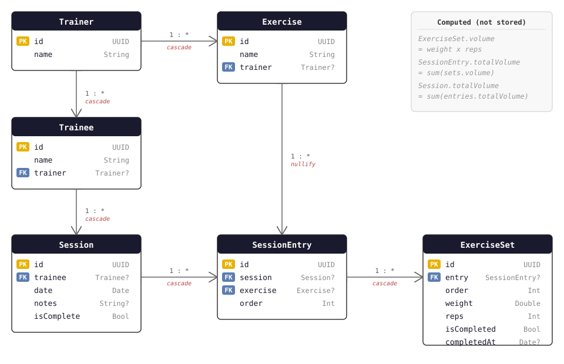

# Gymplicity Data Schema

## Design Principle

Entities hold only their own attributes &mdash; no foreign keys. All
relationships live in dedicated join tables that store only ID pairs.

## Entities

### IdentityEntity

A person using the app. The `isTrainer` flag determines role: a trainer
manages trainees and owns the exercise catalog; a trainee performs workouts.
On first launch the user picks their role.

| Column | Type | Description |
|--------|------|-------------|
| id | UUID | Primary key |
| name | String | Display name |
| isTrainer | Bool | True for trainers, false for trainees |

### ExerciseEntity

A named exercise in the trainer's catalog (e.g. "Bench Press"). Identity
is UUID-based so renaming propagates everywhere. An exercise's link to
the built-in catalog (if any) lives in the `CatalogExercises` attribute
table &mdash; absence of a row means a user-created exercise.

| Column | Type | Description |
|--------|------|-------------|
| id | UUID | Primary key |
| name | String | Human-readable name |

### WorkoutEntity

A single training session or a reusable template. Created on "Start";
completion is recorded as a row in the `WorkoutCompletions` event table
(no row means still active). Templates have `isTemplate = true` and are
never completed &mdash; they serve as blueprints cloned into active
workouts. A template's name lives in the `WorkoutTemplate` attribute
table; free-form notes live in `WorkoutNotes`.

| Column | Type | Description |
|--------|------|-------------|
| id | UUID | Primary key |
| date | Date | Timestamp when the workout was created |
| isTemplate | Bool | True for reusable workout templates |

### WorkoutGroupEntity

An ordered container of sets within a workout. When `isSuperset` is false,
the group represents a standalone exercise (all sets share the same exercise).
When `isSuperset` is true, the group is a deliberate multi-exercise superset
(sets may reference different exercises).

| Column | Type | Description |
|--------|------|-------------|
| id | UUID | Primary key |
| order | Int | Position within the workout (0-based) |
| isSuperset | Bool | False for standalone exercise groups, true for supersets |

### SetEntity

A single set: one exercise at a weight for reps. Completion is recorded
as a row in the `SetCompletions` event table (no row means pending).

| Column | Type | Description |
|--------|------|-------------|
| id | UUID | Primary key |
| order | Int | Position within the group (0-based) |
| weight | Double | Weight lifted, in the user's preferred unit |
| reps | Int | Number of repetitions |

**Computed:**

- `volume: Double` &mdash; `weight * reps`.

## Join Tables

All relationships are expressed through join-only tables storing pairs of
UUIDs. No foreign keys exist on any entity.

### TrainerTrainees

Links a trainer identity to the trainee identities they manage.

| Column | Type |
|--------|------|
| trainerId | UUID |
| traineeId | UUID |

### TrainerExercises

Links a trainer identity to the exercises in their catalog.

| Column | Type |
|--------|------|
| trainerId | UUID |
| exerciseId | UUID |

### IdentityWorkouts

Links an identity to the workouts they have performed.

| Column | Type |
|--------|------|
| identityId | UUID |
| workoutId | UUID |

### WorkoutGroups

Links a workout to the groups it contains.

| Column | Type |
|--------|------|
| workoutId | UUID |
| groupId | UUID |

### GroupSets

Links a group to the sets it contains.

| Column | Type |
|--------|------|
| groupId | UUID |
| setId | UUID |

### ExerciseSets

Links an exercise catalog entry to the sets that reference it.

| Column | Type |
|--------|------|
| exerciseId | UUID |
| setId | UUID |

### TemplateInstances

Links a workout template to the workouts instantiated from it.

| Column | Type |
|--------|------|
| templateId | UUID |
| workoutId | UUID |

### IdentityAliases

Links two identity UUIDs that represent the same person. Created during
pairing when a trainer matches a peer to an existing trainee profile, or
when a trainee matches a peer to an existing trainer profile. Enables
federated identity without destructive UUID rewriting.

| Column | Type |
|--------|------|
| identityId1 | UUID |
| identityId2 | UUID |

### PairedDevices

Tracks which devices have been paired via Multipeer Connectivity sync.
Used to distinguish "Paired" vs "New" peers in the sync UI and to find
the correct remote identity for payload building.

| Column | Type | Description |
|--------|------|-------------|
| localIdentityId | UUID | The local user's identity |
| remoteIdentityId | UUID | The paired remote user's identity |

## Attribute Tables

Single-attribute tables keyed by an entity UUID. Presence of a row carries
the attribute; absence means it is unset &mdash; no nullable columns, no
defaults. Each value is required non-empty at instantiation.

### WorkoutTemplate

The display name of a workout template.

| Column | Type |
|--------|------|
| workoutId | UUID |
| name | String |

### WorkoutNotes

Free-form notes attached to a workout. No row means no notes.

| Column | Type |
|--------|------|
| workoutId | UUID |
| notes | String |

### CatalogExercises

Links an exercise to its built-in catalog slug. Presence of a row means
the exercise came from (or is linked to) the built-in catalog; absence
means a user-created custom exercise.

| Column | Type |
|--------|------|
| exerciseId | UUID |
| catalogId | String |

## Event Tables

Append-only logs of timestamped events. A row records that an event
happened at a moment; multiple rows per subject are allowed. "Did it
happen?" is the presence of any row; "when?" is the most recent row.

### SetCompletions

Records that a set was marked complete. Append-log: a set may be completed
more than once; the latest row wins for "when."

| Column | Type |
|--------|------|
| setId | UUID |
| completedAt | Date |

### WorkoutCompletions

Records that a workout was ended.

| Column | Type |
|--------|------|
| workoutId | UUID |
| completedAt | Date |

### DeviceSyncEvents

Records each successful sync between two identities.

| Column | Type |
|--------|------|
| localIdentityId | UUID |
| remoteIdentityId | UUID |
| syncedAt | Date |

## Relationship Semantics

| Join Table | Meaning | Delete Behavior |
|---|---|---|
| TrainerTrainees | Trainer manages these trainees | Cascade: delete trainer &rarr; delete trainees + data |
| TrainerExercises | Trainer owns these catalog entries | Cascade: delete trainer &rarr; delete exercises |
| IdentityWorkouts | Identity performed these workouts | Cascade: delete identity &rarr; delete workouts |
| WorkoutGroups | Workout contains these groups | Cascade: delete workout &rarr; delete groups |
| GroupSets | Group contains these sets | Cascade: delete group &rarr; delete sets |
| ExerciseSets | Sets reference this exercise | Nullify: delete exercise &rarr; remove join rows, sets remain |
| TemplateInstances | Workout instantiated from this template | Cascade: delete either side &rarr; remove join row |
| IdentityAliases | Two UUIDs represent the same person | Cascade: delete identity &rarr; remove alias rows referencing it |
| PairedDevices | Local identity paired with remote identity | Cascade: delete identity &rarr; remove pairing rows referencing it |

## Computed Properties (not stored)

**IdentityEntity** (via ModelContext traversal):

- `exerciseCatalog` &mdash; own exercises if trainer, else trainer's exercises
- `activeWorkouts` &mdash; incomplete workouts (excludes templates)
- `completedWorkouts` &mdash; completed workouts, newest first (excludes templates)
- `templates` &mdash; workout templates, sorted by name
- `exercisesUsed` &mdash; unique exercises across all workouts
- `lastSet(for:)` &mdash; most recent completed set for a given exercise
- `history(for:)` &mdash; all sets for a given exercise, oldest first

**WorkoutEntity:**

- `totalVolume` &mdash; sum of all set volumes across all groups
- `exerciseCount` &mdash; count of unique exercises across all sets

**WorkoutGroupEntity:**

- `totalVolume` &mdash; sum of all set volumes

## Delete Rule Rationale

- **Cascade** is used down the ownership chain (Identity &rarr; Workout
  &rarr; WorkoutGroup &rarr; Set) so that deleting a parent cleanly removes
  all children and their join rows.
- **Nullify** is used for ExerciseSets so that removing an exercise from
  the catalog does not destroy historical workout data. The set remains;
  only the join row is removed.
- **Attribute and event rows** (WorkoutTemplate, WorkoutNotes,
  CatalogExercises; SetCompletions, WorkoutCompletions, DeviceSyncEvents)
  are cascade-deleted with the entity they describe, so no orphaned
  attribute or event row outlives its subject.
